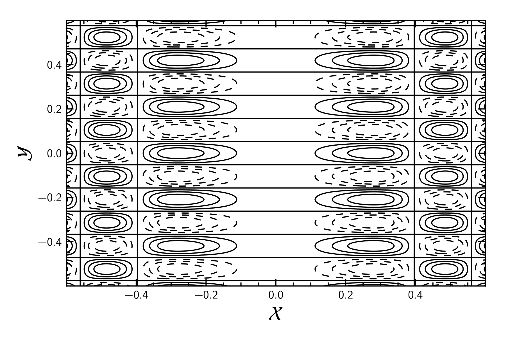
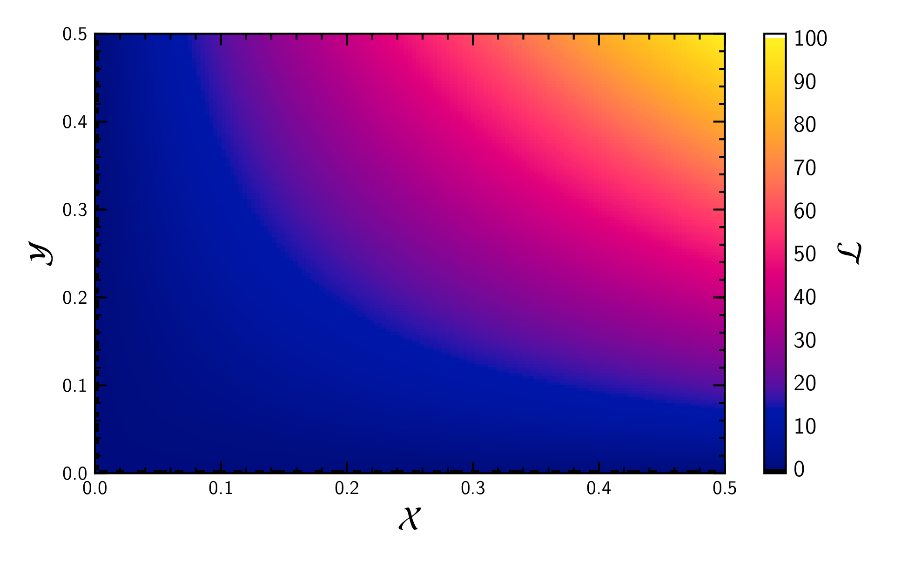
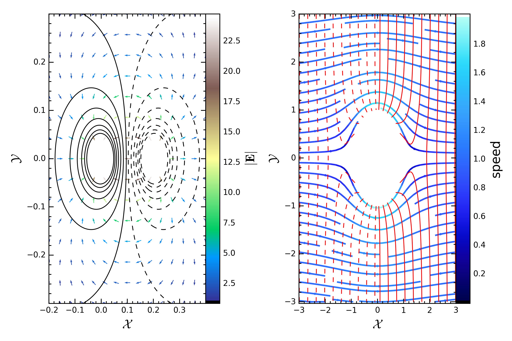
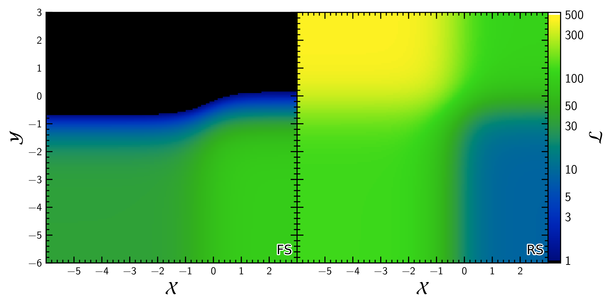

This is a library intended to produce ready to publish (and not so heavy) plots.

# Prerequisites #

  * Python 2.7
  * matplotlib
  * numpy
  * scipy
  * h5py
  * [colorcet](https://bokeh.github.io/colorcet/) (optional)
  * [imgtops](http://imgtops.sourceforge.net/)

All packages can be installed via pip
``` shell
$ pip install <package-name>
```
except imgtops, which is a tool not in the PyPI.

[imgtops can be downloaded from here](http://imgtops.sourceforge.net/). In
order to have imgtops properly installed I did the following:

    * Install python package `pillow`
    * Modify the `setup.py`. Change PIL for pillow

# Examples

## Linear plot

```python
import numpy as np
import PypersPlots as pp
pp.latexify()
x = np.linspace(0.0, 2.0*np.pi, 50)
fig,ax = pp.initPlot()
ax.plot(x,np.sin(x))
ax.plot(x,np.cos(x))
pp.decor(ax,xlim=(0.0,2.0*np.pi),ylim=(-1.0,1.0),ylabel=r"$\mathcal{L}$",xlabel=r"$\mathcal{X}$")
pp.printer(fig,'sin')
```


## Contours plot

``` python
import numpy as np
import PypersPlots as pp
pp.latexify()
x, y = np.meshgrid(*(np.linspace(-0.6,0.6,500),)*2)
z = np.sin(20*x**2)*np.cos(30*y)
fig,ax = pp.initPlot()
CS = pp.theContours(ax,x,y,z)
pp.decor(ax,ylabel=r"$\mathcal{Y}$",xlabel=r"$\mathcal{X}$")
pp.printer(fig,'contours')
```



## Gradient plot

``` python
import numpy as np
import PypersPlots as pp
import extractor as ext
import colorcet as cc
N = 150
data = "temperature.dat"
fname = 'gradient'
x, y, T = ext.dataExtract3col(data, N)
fig, ax = pp.initPlot()
fig.canvas.draw_idle()
CM = pp.theGradient(ax,x,y,T, (0.0, 1.e2),cmap=cc.cm['inferno'])
pp.decor(ax,xlabel=r"$\mathcal{X}$",ylabel=r"$\mathcal{Y}$")
CB = pp.setColorBar(CM,fig,ax,cblabel=r"$\mathcal{L}$",pad=0.05)
pp.printer(fig,'gradient')

```



## More elaborate example examples

### Streams and fields


### Temperature profiles from internal shocks simulations


### Magnetobremsstrahlung


To see how these examples were produced go to the wiki. I will be placing
more elaborated stuff there.

# Recomendations and observations

## Interacting with Python
For a good interactive plotting I suggest using IPython (v2.7). Once in the
command line call the magic command `%matplotlib osx`, if you are using
macOS:
``` python
%matplotlib osx
```
To see the backends available for matplotlib just type:
``` python
%matplotlib -l
```

## For your benefit

This module is under development. Please if you have any issue, comment or
upgrades they are most welcome.
