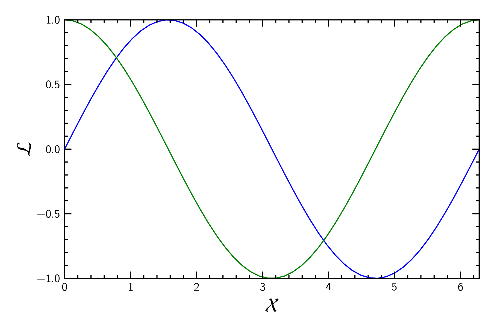
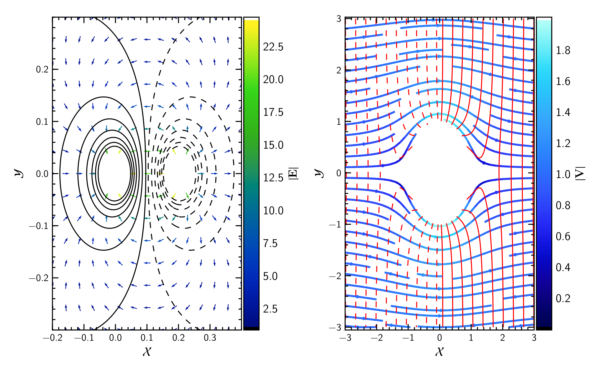

This is a library intended to produce ready to publish (and not so heavy) plots.

# Prerequisites #

  * Python 2.7
  * matplotlib
  * numpy
  * scipy
  * h5py
  * [colorcet](https://bokeh.github.io/colorcet/) (optional)
  * [imgtops](http://imgtops.sourceforge.net/)

# Examples #

## Linear plot ##

```python
import numpy as np
import PypersPlots as pp
pp.latexify()
x = np.linspace(0.0, 2.0*np.pi, 50)
fig,ax = pp.initPlot()
ax.plot(x,np.sin(x))
ax.plot(x,np.cos(x))
pp.decor(ax,xlim=(0.0,2.0*np.pi),ylim=(-1.0,1.0),ylabel=r"$\mathcal{L}$",xlabel=r"$\mathcal{X}$")
pp.printer(fig,'sin')
```


## Contours plot ##

``` python
import numpy as np
import Pypers as pp
x, y = np.meshgrid(*(np.linspace(-1,1,500),)*2)
z = np.sin(20*x**2)*np.cos(30*y)
fig,ax = initPlot()
pp.theContours(ax,x,y,z,colors=['r','b'])
```


## Gradient plot ##

``` python
import numpy as np
import PypersPlots as pp
from matplotlib.offsetbox import AnchoredText
from matplotlib.patheffects import withStroke
N = 150
data = "sL_sR_T.dat"
fname = data.split(".")[0]
sL, sR, TFS = pp.dataExtract3col(data, N)
sL, sR, TRS = pp.dataExtract3col(data, N, cols=(0,1,3))
fig, grid = pp.initGrid(ncols=2,cbmode="single",fscale=1.25)

for ax, T, title in zip(grid, [TFS, TRS], ['FS', 'RS']):
    CM = pp.theGradient(ax, sL, sR, T, (1.0, 5e2))
    at = AnchoredText(title, loc=4, prop=dict(size=12),
                      pad=0., borderpad=0.5,
                      frameon=False)
    at.txt._text.set_path_effects([withStroke(foreground="w", linewidth=2)])
    ax.add_artist(at)
grid.axes_llc.set_xticks(range(-5,3))
CB = pp.setColorBar(CM,fig,grid.cbar_axes[0],cblabel=r"$\mathcal{L}$",log=True, subs=[1.,3.,5.])
pp.decor(grid[0],xlabel=r"$\mathcal{X}$",ylabel=r"$\mathcal{Y}$")
pp.decor(grid[1],xlabel=r"$\mathcal{X}$")
pp.printer(fig,'gradient')
```

## More elaborate example examples ##

### Streams and fields ###


### Magnetobremsstrahlung ###


To produce these examples go to the wiki. I will be placing more elaborated stuff there.

# Recomendations and observations #

## Interacting with Python ##
For a good interactive plotting I suggest using IPython. Once inside call
the magic command `%%matplotlib osx`, if you are using macOS:

``` jupyter-notebook
%%matplotlib osx
```

## About the output ##
Something that must be pointed out is that the PNG image will not have the
correct characters. However the PDF and PGF will.

##  ##

This module is under development. Any issue, comment and upgrades are most welcome.
